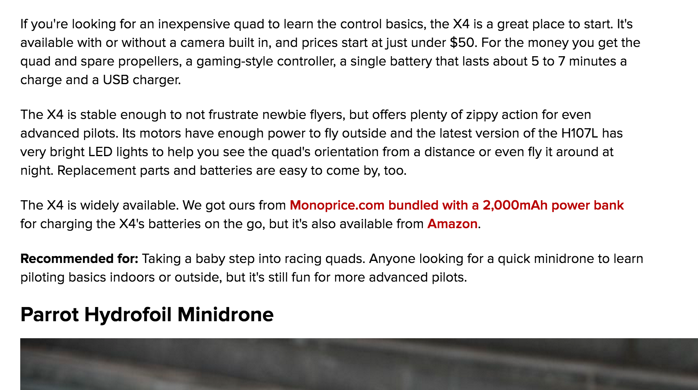
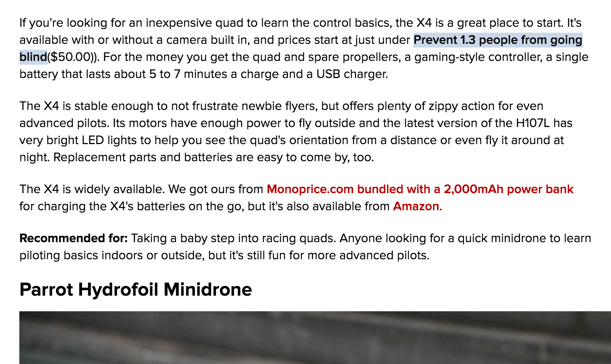

# Perspective

#### One Sentence Summary
Perspective is a Chrome Extension (just a content script, really) that parses the DOM for dollar signs and replaces the associated dollar value with a phrase that represents the potential charitable impact that money could have.

#### Example
Did you know that [it only costs about $40 to sponsor surgery that prevents someone from going blind](http://www.hollows.org/au/home)?  Here's an example of how this chrome extension would alter a web page to give a user some perspective on how far money can go:

**Before**: 

**After**: 

The inserted HTML contains a link to the relevant nonprofit organization.
